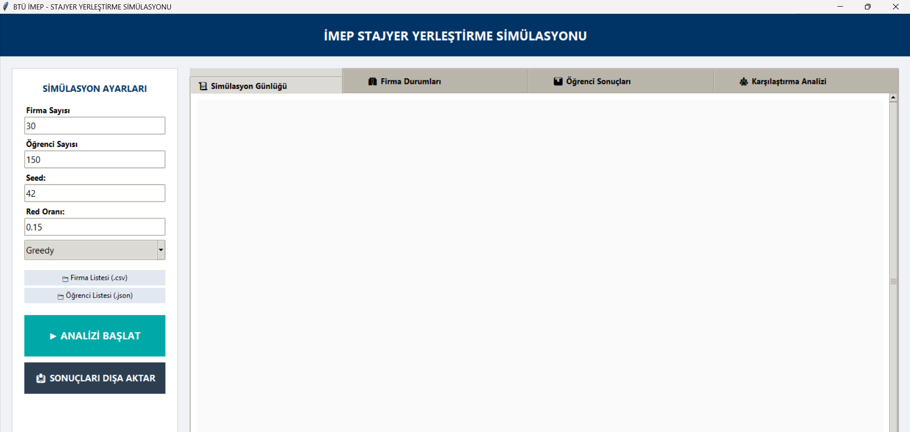
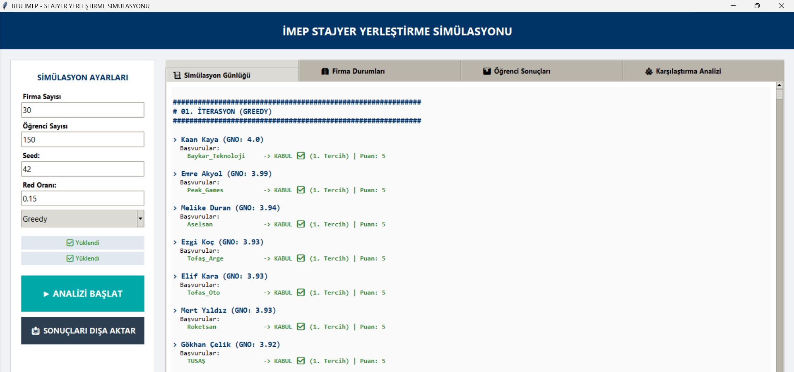
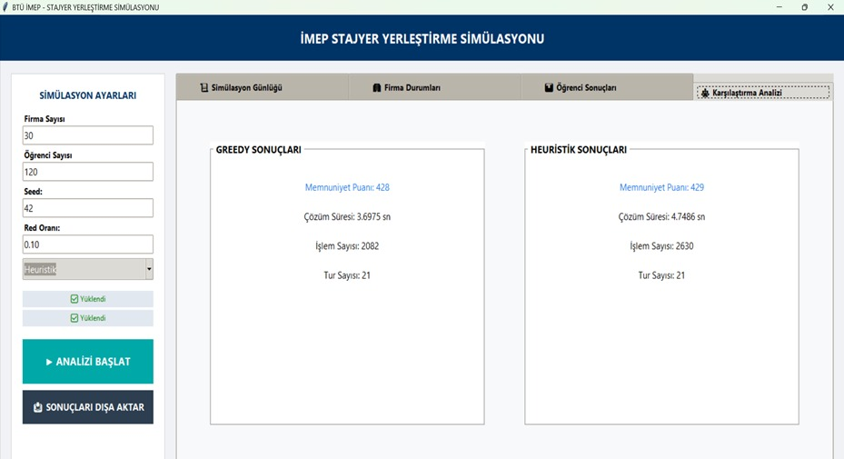

#### **🎓 imep-stajyer-yerlestirme-simulasyonu**

Bu proje, Bursa Teknik Üniversitesi (BTÜ) bünyesinde uygulanan İşletmede Mesleki Eğitim Programı (İMEP) kapsamında, öğrencilerin başarı puanları ve tercihlerine göre en uygun firmalara yerleştirilmesini simüle eden bir Karar Destek Sistemi yazılımıdır.

#### **🎯 Proje Hakkında**

Öğrenci yerleştirme süreci, hem öğrenci memnuniyetini hem de liyakati (GNO) dengelemeyi gerektiren karmaşık bir atama problemidir. Bu yazılım;

GNO Şartı: Firmaların minimum başarı puanı beklentilerini kontrol eder.

Kontenjan Yönetimi: Firma kapasitelerini dinamik olarak takip eder.

Çift Algoritma Analizi: Yerleştirme işlemini hem "Greedy" (Açgözlü) hem de "Heuristik" (Sezgisel) yöntemlerle gerçekleştirerek sonuçları kıyaslar.


#### **🚀 Algoritmalar ve Çalışma Mantığı**
#### **1. Greedy (Açgözlü) Yaklaşım:**

Öğrenciyi, tercih listesindeki ilk uygun (GNO'sunun yettiği ve kontenjanı olan) firmaya doğrudan yerleştirir. Hızlıdır ancak her zaman global optimum memnuniyeti sağlamayabilir.
  
#### **2. Heuristik (Sezgisel) Yaklaşım:**

Öğrenci için sadece uygunluk değil, bir liyakat skoru hesaplar.
$$Skor = (Tercih Puanı \times 10) + (GNO \times 2)$$.Bu yöntemle en yüksek skora sahip adaylar, en uygun yerlere yerleştirilmeye çalışılır.

#### **3. Yerel Arama (Local Search) İyileştirmesi:**

Sezgisel yöntem tamamlandıktan sonra, sistem öğrencilerin memnuniyet puanlarını (tercih sıraları) kontrol eder.
Eğer iki öğrenci yer değiştirerek daha yüksek bir toplam memnuniyete ulaşıyorsa sistem otomatik olarak bu takası gerçekleştirir.

#### **📸 Uygulama Ekran Görüntüleri**

Projenin arayüzü ve çalışma mantığını daha iyi anlamak için aşağıdaki görselleri inceleyebilirsiniz:

#### **🖥️1. Ana Kontrol Paneli**

Simülasyonun başlangıç noktası olan, parametrelerin ve dosya seçimlerinin yapıldığı arayüzdür.


#### **Simülasyon Ayarları:** Firma ve öğrenci sayıları ile rastsallık (Seed) değeri buradan belirlenir.

#### **Dosya Yönetimi:** Kontenjan verileri için .csv, aday verileri için .json dosyaları sisteme tanımlanır.


#### **📜2. Simülasyon Günlüğü (Log Sistemi)**
Yerleştirme sürecinin her adımını şeffaf bir şekilde takip etmenizi sağlar.

Atama sürecindeki her adımın teknik gerekçesini (GNO, kontenjan, liyakat) anlık olarak raporlar. 

Algoritma seçimlerine göre çıktılar farklılık gösterir:

| **Greedy (Açgözlü) Akışı** | **Heuristik (Sezgisel) Akışı** |
| :---: | :---: |
|  |  |
| *Şartı sağlayan ilk firmayı seçer.* | *Adaylar arasından en yüksek skorluyu seçer.* |

#### **Görsel Göstergeler**
* **Mavi:** Yeni öğrenci/tur başlangıcını temsil eder.
* **Yeşil (✅):** Başarılı yerleşme ve kazanılan memnuniyet puanıdır.
* **Kırmızı (✖):** GNO yetersizliği veya kontenjan doluluğu nedeniyle alınan reddi gösterir.
* **Turuncu:** Sezgisel yöntemde hesaplanan aday havuzu ve liyakat skorlarını belirtir.

#### **📉 3. Performans ve Karşılaştırma Analizi**

Simülasyonun sonunda sistem, her iki algoritmanın (Greedy vs Heuristik) verimliliğini matematiksel metriklerle kıyaslar.



#### **Memnuniyet Puanı:** 
Öğrencilerin tercih sıralarına göre aldıkları puanların toplamıdır; Heuristik yöntem genellikle bu puanı daha yukarı taşır.

#### **Çözüm Süresi:**
Algoritmanın hesaplamayı bitirme süresidir; Greedy yaklaşımı doğrudan atama yaptığı için daha hızlıdır.

#### **İşlem ve Tur Sayısı:**
Sistemin karara ulaşmak için yaptığı iterasyon sayısıdır.

#### **🛠️ Kullanılan Teknolojiler**

Python: Çekirdek programlama dili.

Tkinter: Görsel kullanıcı arayüzü (GUI).

Pandas & Numpy: Veri setlerinin işlenmesi ve analizi.

Openpyxl: Sonuçların Excel formatında raporlanması.

#### **📋 Nasıl Kullanılır?**

#### **1.Gereksinimleri Yükleyin**

Projenin çalışması için gerekli olan Python kütüphanelerini aşağıdaki komutu terminalinize (veya CMD) yapıştırarak yükleyebilirsiniz.
```bash

pip install pandas numpy openpyxl
```


#### **2.Dosyaları Hazırlayın**

Projenin çalışması için iki temel veri dosyasına ihtiyaç vardır:

Firma Listesi: Kontenjan ve GNO şartlarını içeren bir .csv dosyası.

Öğrenci Listesi: Tercihleri içeren bir .json dosyası.

#### **3. Uygulamayı Çalıştırın**

Ana script dosyasını çalıştırarak simülasyonu başlatın: 

```bash

python imep_ogrenci_yerleştirme_simülasyonu.py
```

#### **📄 Raporlama ve Çıktı Yapısı**

Simülasyon tamamlandığında sistem, yerleştirme sürecini hem operasyonel hem de istatistiksel düzeyde analiz eder. Veriler üç ana koldan kullanıcıya sunulur:

1. Gerçek Zamanlı Simülasyon Günlüğü
Uygulama arayüzündeki loğ ekranı, yerleştirme sürecini bir "karar defteri" gibi tutar:

İşlem Detayları: Her öğrencinin tercih listesindeki firmalara yaptığı başvurular ve aldığı yanıtlar (Kabul/Red) anlık olarak izlenebilir.

Red Mekanizması Takibi: Firmaların olasılıksal reddi sonrası açıkta kalan öğrencilerin yeniden değerlendirilme süreçleri adım adım raporlanır.

2. Algoritma Karşılaştırma Paneli
İki farklı yaklaşımın (Greedy ve Heuristik) verimliliğini ölçmek için aşağıdaki metrikler dinamik olarak hesaplanır:

Toplam Memnuniyet Puanı: Öğrencilerin tercih sıralarına göre aldıkları puanların toplamı (Yerleştirme kalitesini gösterir).

İşlem ve Tur Sayısı: Algoritmanın sonuca ulaşmak için kaç iterasyon yaptığı (Hesaplama karmaşıklığını gösterir).

Çözüm Süresi: Milisaniye düzeyinde algoritma çalışma hızı.

3.Profesyonel Çıktı Yönetimi (Excel/CSV)

Excel (.xlsx) veya .csv formatında üretilen nihai rapor, sadece bir liste değil, kapsamlı bir veri setidir.
Simülasyon sonuçları dışa aktarıldığında aşağıdaki veri yapısında düzenli bir rapor oluşturulur:

| Öğrenci Adı | GNO | Atanan Firma | Yerleşme Türü | Memnuniyet Puanı |
| :--- | :---: | :--- | :---: | :---: |
| Ahmet Yılmaz | 3.85 | TUSAŞ | 1. İterasyon | 5 |
| Elif Demir | 3.42 | Peak Games | Ek Kontenjan | 3 |

Detaylı Analiz: Çıktı dosyası; kontenjan doluluk oranları, en çok tercih edilen firmalar ve yerleşememe nedenleri gibi konularda ileri seviye analiz yapmaya uygun formatta yapılandırılmıştır

💡 Geliştirici Notu
Bu simülasyon, gerçek dünya verileriyle test edilebilir ve firma-öğrenci eşleşmelerinde adaleti sağlamak adına geliştirilmiştir.
